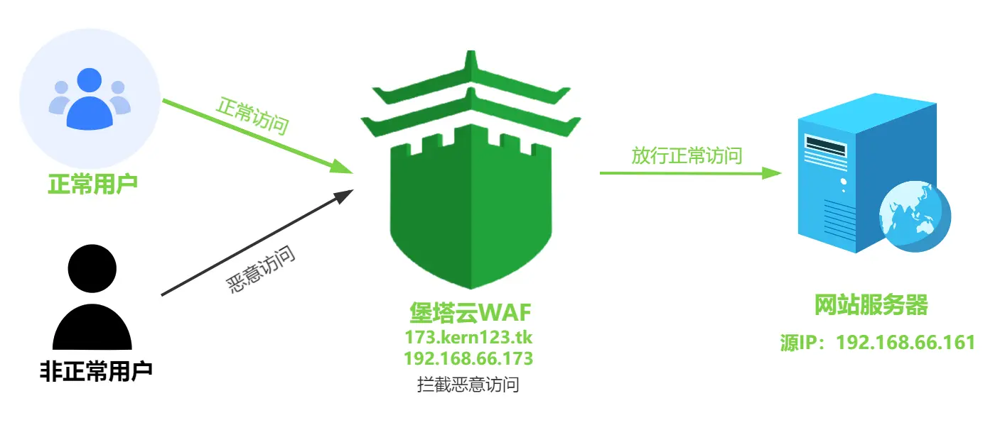
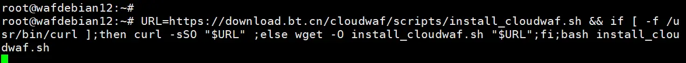
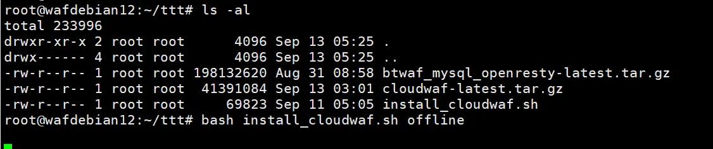
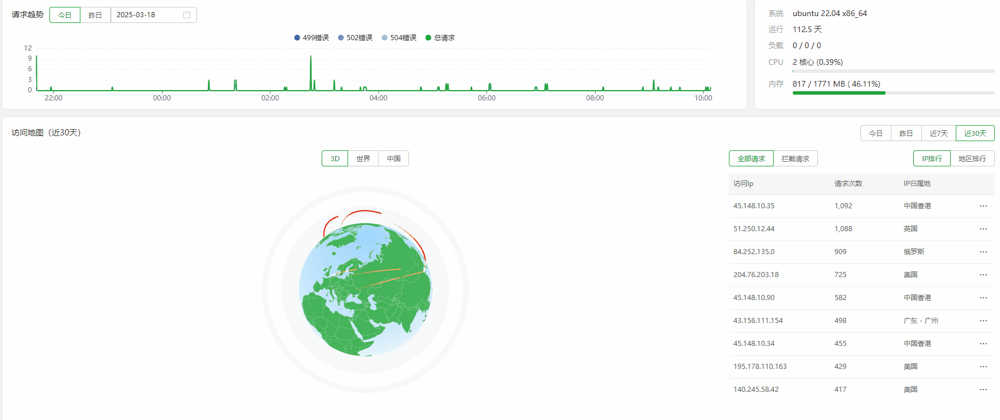
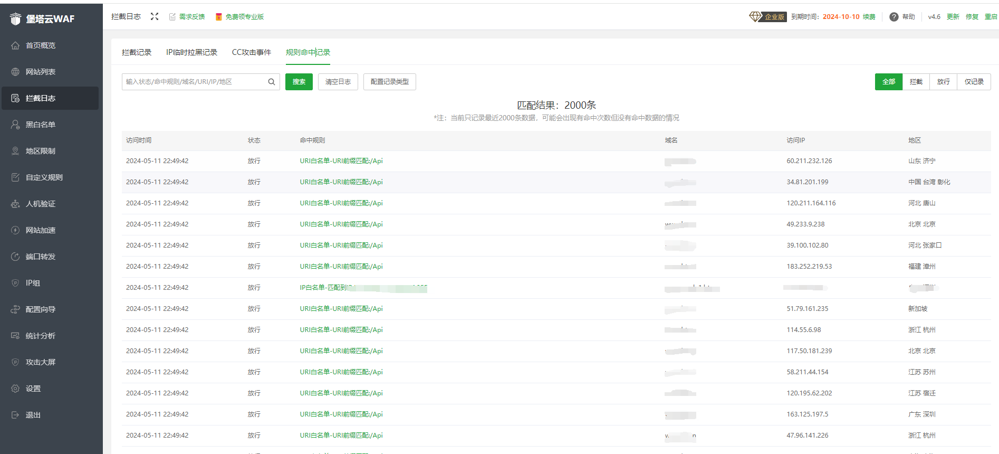
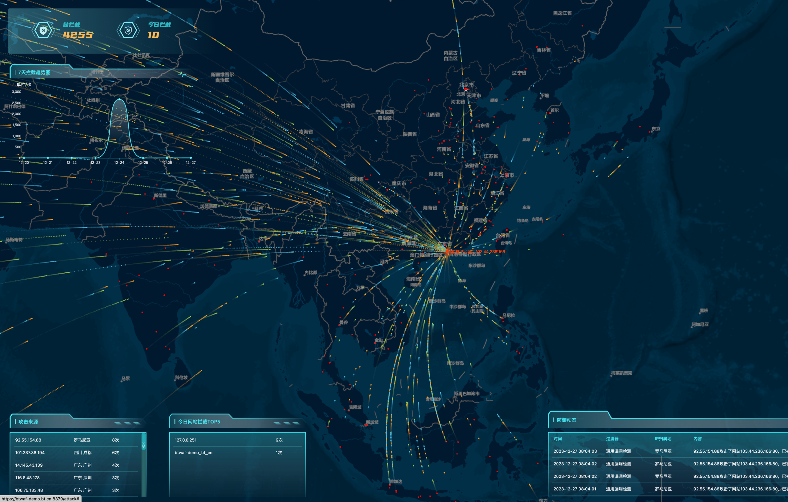

<div align="center">

</div>

<h1 align="center">aaWAF</h1>

<div align="center">

[](https://github.com/aaPanel/BT-WAF)
[](https://github.com/aaPanel/BT-WAF)
[](https://github.com/aaPanel/BT-WAF)
[](https://github.com/aaPanel/BT-WAF)

</div>
<p align="center">
  <a href="https://www.aapanel.com/new/waf.html">official website</a> | 
  <a href="https://www.kancloud.cn/kern123/cloudwaf/3198565">Using Tutorials</a> |
  <a href="https://btwaf-demo.bt.cn:8379/c0edce7a">Demo</a> |
  <a href="https://yenvb8apub.feishu.cn/sheets/AQafs3FTEhYw8VtEXPJccZwdnUh">ARM and Domestic System Compatibility Table</a> |
<a href="./english_update.md">Update log</a>
</p>


## aaWAF Introduction

>**Free private cloud WAF firewall**
Baota Cloud WAF has been certified by millions of users to safeguard your business
By using reverse proxy, website traffic first reaches the Baota Cloud WAF
After being detected and filtered by Baota Cloud WAF, it will be transferred to the website server that originally provided the service.
Baota Cloud WAF is an open-source web application firewall that can protect websites from SQL injection, XSS，CSRF，SSRF， Command injection, code injection, local file inclusion, remote file inclusion, and other attacks


## Demo
URL：https://btwaf-demo.bt.cn:8379/c0edce7a<br/>

## Working principle diagram of Baota Cloud WAF
<p align="center">
    
</p>


## install
Use SSH tool to log in to the server and execute the following command to install:
```shell
URL=https://node.aapanel.com/cloudwaf_en/scripts/install_cloudwaf_en.sh && if [ -f /usr/bin/curl ];then curl -sSO "$URL" ;else wget -O install_cloudwaf_en.sh "$URL";fi;bash install_cloudwaf_en.sh
```
<p align="center">
    
</p>

## **Offline installation**
> Note that this installation method is suitable for selecting when the server cannot connect to a public network node
* Docker must be manually installed during offline installation, otherwise it cannot be installed
* Before offline installation, please ensure that your server has the tar gzip curl netstat ss docker command. You can use this command to check if it exists:
```
Packs=("curl" "tar" "gzip" "netstat" "ss" "docker" ); for pack in "${Packs[@]}"; do command -v "$pack" >/dev/null 2>&1 || echo -e "\033[31mError: $pack cmd not found\033[0m"; done
```

- Offline installation script:[Click to download offline installation script](https://node.aapanel.com/cloudwaf_en/scripts/install_cloudwaf_en.sh)
- Download image file:[Download image file](https://node.aapanel.com/cloudwaf_en/package/btwaf_mysql_openresty-latest.tar.gz)
- Download the cloudwaf program file:[Download cloudwaf](https://node.aapanel.com/cloudwaf_en/package/cloudwaf-latest.tar.gz)

After downloading the above files, use tools such as Xftp and winscp to upload them to the server, place the downloaded files in the same path, and then execute the installation command to install offline:
```
bash install_cloudwaf.sh offline
```
<p align="center">
    
</p>

> After installation, the login steps are the same as online


## Function Introduction
0.3D map
<p align="center">
    
</p>
1.Home Overview
<p align="center">
    
</p>

2.Intercept record
<p align="center">
    
</p>

3.Hit record
<p align="center">
    
</p>

4.Attack map
<p align="center">
    
</p>

##  Contact Us
>1. GitHub Issue 
>2. WeChat 

